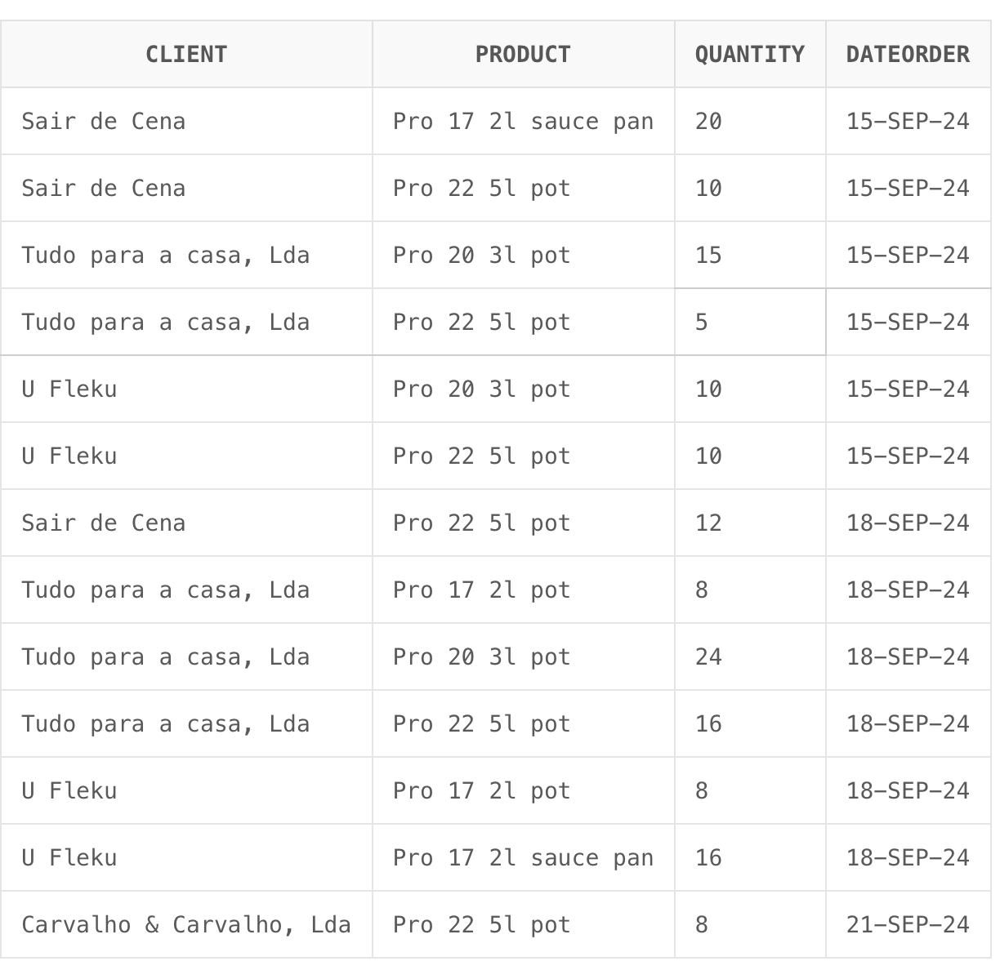
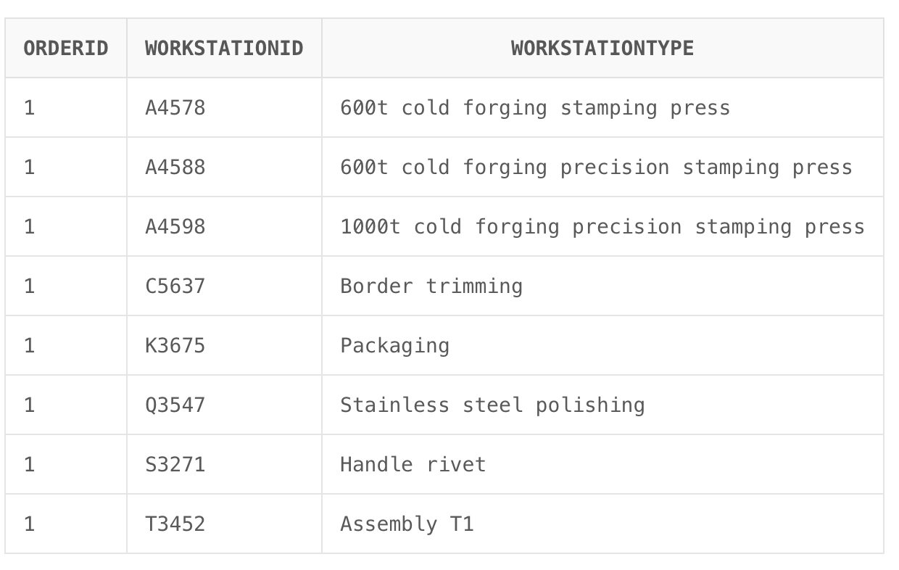
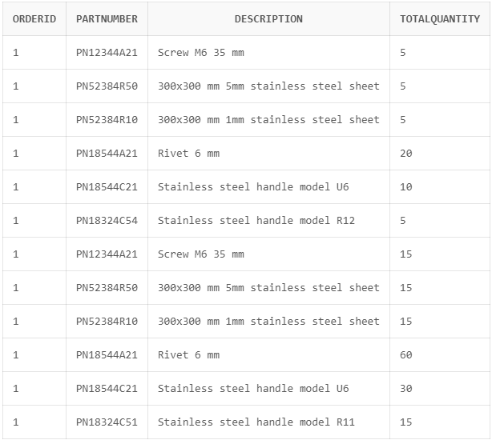
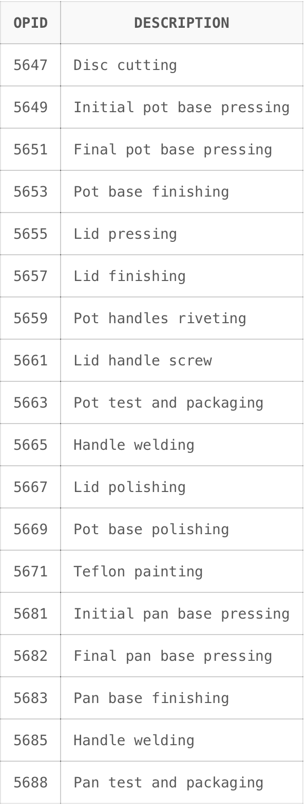
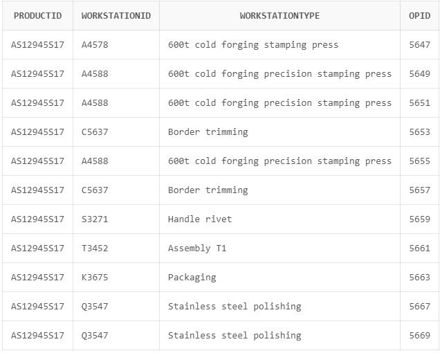

# SQL Code

`````sql
DROP TABLE BOM CASCADE CONSTRAINTS;
DROP TABLE BOO CASCADE CONSTRAINTS;
DROP TABLE Client CASCADE CONSTRAINTS;
DROP TABLE Material CASCADE CONSTRAINTS;
DROP TABLE MaterialBOM CASCADE CONSTRAINTS;
DROP TABLE Operation CASCADE CONSTRAINTS;
DROP TABLE OperationBOO CASCADE CONSTRAINTS;
DROP TABLE Orders CASCADE CONSTRAINTS;
DROP TABLE Product CASCADE CONSTRAINTS;
DROP TABLE Product_Family CASCADE CONSTRAINTS;
DROP TABLE Product_Orders CASCADE CONSTRAINTS;
DROP TABLE ProductionOrder CASCADE CONSTRAINTS;
DROP TABLE Workstations CASCADE CONSTRAINTS;
DROP TABLE WorkstationTypes CASCADE CONSTRAINTS;
DROP TABLE WorkstationTypes_Operation CASCADE CONSTRAINTS;

CREATE TABLE BOM (
                     PartNumber  varchar2(255) NOT NULL,
                     Description varchar2(200),
                     Quantity    number(10),
                     ProductID   varchar2(255) NOT NULL,
                     PRIMARY KEY (PartNumber,
                                  ProductID));

CREATE TABLE BOO (
                     OPNumber varchar2(255) NOT NULL,
                     OPID     varchar2(255) NOT NULL,
                     FamilyID varchar2(255) NOT NULL,
                     PRIMARY KEY (OPNumber,
                                  FamilyID));

CREATE TABLE Client (
                        ClientID varchar2(255) NOT NULL,
                        Name     varchar2(50),
                        VATIN    varchar2(20),
                        Address  varchar2(100),
                        ZIP      varchar2(20),
                        Town     varchar2(50),
                        Country  varchar2(20),
                        Email    varchar2(100),
                        Phone    number(15),
                        PRIMARY KEY (ClientID));

CREATE TABLE Material (
                          MaterialID varchar2(255) NOT NULL,
                          Name       varchar2(255),
                          Stock      number(10),
                          PRIMARY KEY (MaterialID));

CREATE TABLE MaterialBOM (
                             QuantityMaterial number(10),
                             MaterialID       varchar2(255) NOT NULL,
                             PartNumber       varchar2(255) NOT NULL,
                             ProductID        varchar2(255) NOT NULL);

CREATE TABLE Operation (
                           OPID        varchar2(255) NOT NULL,
                           Description varchar2(200),
                           PRIMARY KEY (OPID));

CREATE TABLE OperationBOO (
                              Sequence varchar2(255),
                              OPID     varchar2(255) NOT NULL);

CREATE TABLE Orders (
                        OrderID      varchar2(255) NOT NULL,
                        DateOrder    date,
                        DateDelivery date,
                        Status       varchar2(20),
                        ClientID     varchar2(255) NOT NULL,
                        PRIMARY KEY (OrderID));

CREATE TABLE Product (
                         ProductID   varchar2(255) NOT NULL,
                         Name        varchar2(20),
                         Description varchar2(200),
                         Priority    varchar2(10),
                         FamilyID    varchar2(255) NOT NULL,
                         PRIMARY KEY (ProductID));

CREATE TABLE Product_Family (
                                FamilyID varchar2(255) NOT NULL,
                                Name     varchar2(20),
                                PRIMARY KEY (FamilyID));

CREATE TABLE Product_Orders (
                                ProductID        varchar2(255) NOT NULL,
                                OrderID          varchar2(255) NOT NULL,
                                QuantityProducts number(10),
                                PRIMARY KEY (ProductID,
                                             OrderID));

CREATE TABLE ProductionOrder (
                                 PO_ID     nvarchar2(255) NOT NULL,
                                 StartDate date,
                                 EndDate   date,
                                 Sequence  varchar2(100),
                                 WSID      varchar2(255) NOT NULL,
                                 ProductID varchar2(255) NOT NULL,
                                 PRIMARY KEY (PO_ID));

CREATE TABLE Workstations (
                              WSID        varchar2(255) NOT NULL,
                              Name        varchar2(20),
                              Description varchar2(300),
                              Time        number(10),
                              WTID        varchar2(255) NOT NULL,
                              PRIMARY KEY (WSID));
COMMENT ON COLUMN Workstations.Name IS 'minutes';

CREATE TABLE WorkstationTypes (
                                  WTID varchar2(255) NOT NULL,
                                  Name varchar2(100),
                                  PRIMARY KEY (WTID));

CREATE TABLE WorkstationTypes_Operation (
                                            WTID varchar2(255) NOT NULL,
                                            OPID varchar2(255) NOT NULL,
                                            PRIMARY KEY (WTID,
                                                         OPID));

ALTER TABLE Orders ADD CONSTRAINT FKOrders325878 FOREIGN KEY (ClientID) REFERENCES Client (ClientID);
ALTER TABLE Product ADD CONSTRAINT FKProduct331202 FOREIGN KEY (FamilyID) REFERENCES Product_Family (FamilyID);
ALTER TABLE Workstations ADD CONSTRAINT FKWorkstatio342984 FOREIGN KEY (WTID) REFERENCES WorkstationTypes (WTID);
ALTER TABLE BOM ADD CONSTRAINT FKBOM448648 FOREIGN KEY (ProductID) REFERENCES Product (ProductID);
ALTER TABLE BOO ADD CONSTRAINT FKBOO365646 FOREIGN KEY (OPID) REFERENCES Operation (OPID);
ALTER TABLE BOO ADD CONSTRAINT FKBOO783413 FOREIGN KEY (FamilyID) REFERENCES Product_Family (FamilyID);
ALTER TABLE MaterialBOM ADD CONSTRAINT FKMaterialBO62226 FOREIGN KEY (MaterialID) REFERENCES Material (MaterialID);
ALTER TABLE MaterialBOM ADD CONSTRAINT FKMaterialBO949651 FOREIGN KEY (PartNumber, ProductID) REFERENCES BOM (PartNumber, ProductID);
ALTER TABLE ProductionOrder ADD CONSTRAINT FKProduction975084 FOREIGN KEY (WSID) REFERENCES Workstations (WSID);
ALTER TABLE ProductionOrder ADD CONSTRAINT FKProduction574612 FOREIGN KEY (ProductID) REFERENCES Product (ProductID);
ALTER TABLE OperationBOO ADD CONSTRAINT FKOperationB256995 FOREIGN KEY (OPID) REFERENCES Operation (OPID);
ALTER TABLE Product_Orders ADD CONSTRAINT FKProduct_Or564210 FOREIGN KEY (ProductID) REFERENCES Product (ProductID);
ALTER TABLE Product_Orders ADD CONSTRAINT FKProduct_Or260352 FOREIGN KEY (OrderID) REFERENCES Orders (OrderID);
ALTER TABLE WorkstationTypes_Operation ADD CONSTRAINT FKWorkstatio646034 FOREIGN KEY (WTID) REFERENCES WorkstationTypes (WTID);
ALTER TABLE WorkstationTypes_Operation ADD CONSTRAINT FKWorkstatio733349 FOREIGN KEY (OPID) REFERENCES Operation (OPID);

INSERT INTO Client(ClientID, Name, VATIN, Address, ZIP, Town, Country, Email, Phone) values (456, 'Carvalho & Carvalho, Lda', 'PT501245987', 'Tv. Augusto Lessa 23', '4200-047', 'Porto', 'Portugal', 'idont@care.com', 003518340500);
INSERT INTO Client(ClientID, Name, VATIN, Address, ZIP, Town, Country, Email, Phone) values (785, 'Tudo para a casa, Lda', 'PT501245488', 'R. Dr. Barros 93', '4465-219', 'São Mamede de Infesta', 'Portugal', 'me@neither.com', 003518340500);
INSERT INTO Client(ClientID, Name, VATIN, Address, ZIP, Town, Country, Email, Phone) values (657, 'Sair de Cena', 'PT501242417', 'EDIFICIO CRISTAL lj18, R. António Correia de Carvalho 88', '4400-023', 'Vila Nova de Gaia', 'Portugal', 'some@email.com', 003518340500);
INSERT INTO Client(ClientID, Name, VATIN, Address, ZIP, Town, Country, Email, Phone) values (348, 'U Fleku', 'CZ6451237810', 'Křemencova 11', '110 00', 'Nové Město', 'Czechia', 'some.random@email.cz', 004201234567);

INSERT INTO Product_Family(FamilyID, Name) values (125, 'Pro Line pots');
INSERT INTO Product_Family(FamilyID, Name) values (130, 'La Belle pots');
INSERT INTO Product_Family(FamilyID, Name) values (132, 'Pro Line pans');
INSERT INTO Product_Family(FamilyID, Name) values (145, 'Pro Line lids');
INSERT INTO Product_Family(FamilyID, Name) values (146, 'Pro Clear lids');

INSERT INTO Product(ProductID, Name, Description, FamilyID) values ('AS12945T22', 'La Belle 22 5l pot', '5l 22 cm aluminium and teflon non stick pot', 130);
INSERT INTO Product(ProductID, Name, Description, FamilyID) values ('AS12945S22', 'Pro 22 5l pot', '5l 22 cm stainless steel pot', 125);
INSERT INTO Product(ProductID, Name, Description, FamilyID) values ('AS12945S20', 'Pro 20 3l pot', '3l 20 cm stainless steel pot', 125);
INSERT INTO Product(ProductID, Name, Description, FamilyID) values ('AS12945S17', 'Pro 17 2l pot', '2l 17 cm stainless steel pot', 125);
INSERT INTO Product(ProductID, Name, Description, FamilyID) values ('AS12945P17', 'Pro 17 2l sauce pan', '2l 17 cm stainless steel souce pan', 132);
INSERT INTO Product(ProductID, Name, Description, FamilyID) values ('AS12945S48', 'Pro 17 lid', '17 cm stainless steel lid', 145);
INSERT INTO Product(ProductID, Name, Description, FamilyID) values ('AS12945G48', 'Pro Clear 17 lid', '17 cm glass lid', 146);

INSERT INTO Orders (OrderID, ClientID, DateOrder, DateDelivery) VALUES (1, 785, TO_DATE('15/09/2024', 'DD/MM/YYYY'), TO_DATE('23/09/2024', 'DD/MM/YYYY'));
INSERT INTO Orders (OrderID, ClientID, DateOrder, DateDelivery) VALUES (2, 657, TO_DATE('15/09/2024', 'DD/MM/YYYY'), TO_DATE('26/09/2024', 'DD/MM/YYYY'));
INSERT INTO Orders (OrderID, ClientID, DateOrder, DateDelivery) VALUES (3, 348, TO_DATE('15/09/2024', 'DD/MM/YYYY'), TO_DATE('25/09/2024', 'DD/MM/YYYY'));
INSERT INTO Orders (OrderID, ClientID, DateOrder, DateDelivery) VALUES (4, 785, TO_DATE('18/09/2024', 'DD/MM/YYYY'), TO_DATE('25/09/2024', 'DD/MM/YYYY'));
INSERT INTO Orders (OrderID, ClientID, DateOrder, DateDelivery) VALUES (5, 657, TO_DATE('18/09/2024', 'DD/MM/YYYY'), TO_DATE('25/09/2024', 'DD/MM/YYYY'));
INSERT INTO Orders (OrderID, ClientID, DateOrder, DateDelivery) VALUES (6, 348, TO_DATE('18/09/2024', 'DD/MM/YYYY'), TO_DATE('26/09/2024', 'DD/MM/YYYY'));
INSERT INTO Orders (OrderID, ClientID, DateOrder, DateDelivery) VALUES (7, 456, TO_DATE('21/09/2024', 'DD/MM/YYYY'), TO_DATE('26/09/2024', 'DD/MM/YYYY'));

INSERT INTO Product_Orders(OrderID, ProductID, QuantityProducts) values (1, 'AS12945S22', 5);
INSERT INTO Product_Orders(OrderID, ProductID, QuantityProducts) values (1, 'AS12945S20', 15);
INSERT INTO Product_Orders(OrderID, ProductID, QuantityProducts) values (2, 'AS12945S22', 10);
INSERT INTO Product_Orders(OrderID, ProductID, QuantityProducts) values (2, 'AS12945P17', 20);
INSERT INTO Product_Orders(OrderID, ProductID, QuantityProducts) values (3, 'AS12945S22', 10);
INSERT INTO Product_Orders(OrderID, ProductID, QuantityProducts) values (3, 'AS12945S20', 10);
INSERT INTO Product_Orders(OrderID, ProductID, QuantityProducts) values (4, 'AS12945S20', 24);
INSERT INTO Product_Orders(OrderID, ProductID, QuantityProducts) values (4, 'AS12945S22', 16);
INSERT INTO Product_Orders(OrderID, ProductID, QuantityProducts) values (4, 'AS12945S17', 8);
INSERT INTO Product_Orders(OrderID, ProductID, QuantityProducts) values (5, 'AS12945S22', 12);
INSERT INTO Product_Orders(OrderID, ProductID, QuantityProducts) values (6, 'AS12945S17', 8);
INSERT INTO Product_Orders(OrderID, ProductID, QuantityProducts) values (6, 'AS12945P17', 16);
INSERT INTO Product_Orders(OrderID, ProductID, QuantityProducts) values (7, 'AS12945S22', 8);

INSERT INTO Operation(OPID, Description) values (5647, 'Disc cutting');
INSERT INTO Operation(OPID, Description) values (5649, 'Initial pot base pressing');
INSERT INTO Operation(OPID, Description) values (5651, 'Final pot base pressing');
INSERT INTO Operation(OPID, Description) values (5653, 'Pot base finishing');
INSERT INTO Operation(OPID, Description) values (5655, 'Lid pressing');
INSERT INTO Operation(OPID, Description) values (5657, 'Lid finishing');
INSERT INTO Operation(OPID, Description) values (5659, 'Pot handles riveting');
INSERT INTO Operation(OPID, Description) values (5661, 'Lid handle screw');
INSERT INTO Operation(OPID, Description) values (5663, 'Pot test and packaging');
INSERT INTO Operation(OPID, Description) values (5665, 'Handle welding');
INSERT INTO Operation(OPID, Description) values (5667, 'Lid polishing');
INSERT INTO Operation(OPID, Description) values (5669, 'Pot base polishing');
INSERT INTO Operation(OPID, Description) values (5671, 'Teflon painting');
INSERT INTO Operation(OPID, Description) values (5681, 'Initial pan base pressing');
INSERT INTO Operation(OPID, Description) values (5682, 'Final pan base pressing');
INSERT INTO Operation(OPID, Description) values (5683, 'Pan base finishing');
INSERT INTO Operation(OPID, Description) values (5685, 'Handle welding');
INSERT INTO Operation(OPID, Description) values (5688, 'Pan test and packaging');

INSERT INTO WorkstationTypes(WTID, Name) values ('A4578', '600t cold forging stamping press');
INSERT INTO WorkstationTypes(WTID, Name) values ('A4588', '600t cold forging precision stamping press');
INSERT INTO WorkstationTypes(WTID, Name) values ('A4598', '1000t cold forging precision stamping press');
INSERT INTO WorkstationTypes(WTID, Name) values ('S3271', 'Handle rivet');
INSERT INTO WorkstationTypes(WTID, Name) values ('K3675', 'Packaging');
INSERT INTO WorkstationTypes(WTID, Name) values ('K3676', 'Packaging for large itens');
INSERT INTO WorkstationTypes(WTID, Name) values ('C5637', 'Border trimming');
INSERT INTO WorkstationTypes(WTID, Name) values ('D9123', 'Spot welding');
INSERT INTO WorkstationTypes(WTID, Name) values ('Q5478', 'Teflon application station');
INSERT INTO WorkstationTypes(WTID, Name) values ('Q3547', 'Stainless steel polishing');
INSERT INTO WorkstationTypes(WTID, Name) values ('T3452', 'Assembly T1');
INSERT INTO WorkstationTypes(WTID, Name) values ('G9273', 'Circular glass cutting');
INSERT INTO WorkstationTypes(WTID, Name) values ('G9274', 'Glass trimming');

INSERT INTO WorkstationTypes_Operation(OPID, WTID) values (5647, 'A4578');
INSERT INTO WorkstationTypes_Operation(OPID, WTID) values (5647, 'A4588');
INSERT INTO WorkstationTypes_Operation(OPID, WTID) values (5647, 'A4598');
INSERT INTO WorkstationTypes_Operation(OPID, WTID) values (5649, 'A4588');
INSERT INTO WorkstationTypes_Operation(OPID, WTID) values (5649, 'A4598');
INSERT INTO WorkstationTypes_Operation(OPID, WTID) values (5651, 'A4588');
INSERT INTO WorkstationTypes_Operation(OPID, WTID) values (5651, 'A4598');
INSERT INTO WorkstationTypes_Operation(OPID, WTID) values (5653, 'C5637');
INSERT INTO WorkstationTypes_Operation(OPID, WTID) values (5655, 'A4588');
INSERT INTO WorkstationTypes_Operation(OPID, WTID) values (5655, 'A4598');
INSERT INTO WorkstationTypes_Operation(OPID, WTID) values (5657, 'C5637');
INSERT INTO WorkstationTypes_Operation(OPID, WTID) values (5659, 'S3271');
INSERT INTO WorkstationTypes_Operation(OPID, WTID) values (5661, 'T3452');
INSERT INTO WorkstationTypes_Operation(OPID, WTID) values (5663, 'K3675');
INSERT INTO WorkstationTypes_Operation(OPID, WTID) values (5665, 'D9123');
INSERT INTO WorkstationTypes_Operation(OPID, WTID) values (5667, 'Q3547');
INSERT INTO WorkstationTypes_Operation(OPID, WTID) values (5669, 'Q3547');
INSERT INTO WorkstationTypes_Operation(OPID, WTID) values (5671, 'Q5478');
INSERT INTO WorkstationTypes_Operation(OPID, WTID) values (5681, 'A4588');
INSERT INTO WorkstationTypes_Operation(OPID, WTID) values (5681, 'A4598');
INSERT INTO WorkstationTypes_Operation(OPID, WTID) values (5682, 'A4588');
INSERT INTO WorkstationTypes_Operation(OPID, WTID) values (5682, 'A4598');
INSERT INTO WorkstationTypes_Operation(OPID, WTID) values (5683, 'C5637');
INSERT INTO WorkstationTypes_Operation(OPID, WTID) values (5685, 'D9123');
INSERT INTO WorkstationTypes_Operation(OPID, WTID) values (5688, 'K3675');

INSERT INTO Workstations(WSID, WTID, Name, Description) values (9875, 'A4578', 'Press 01', '220-630t cold forging press');
INSERT INTO Workstations(WSID, WTID, Name, Description) values (9886, 'A4578', 'Press 02', '220-630t cold forging press');
INSERT INTO Workstations(WSID, WTID, Name, Description) values (9847, 'A4588', 'Press 03', '220-630t precision cold forging press');
INSERT INTO Workstations(WSID, WTID, Name, Description) values (9855, 'A4588', 'Press 04', '160-1000t precison cold forging press');
INSERT INTO Workstations(WSID, WTID, Name, Description) values (8541, 'S3271', 'Rivet 02', 'Rivet station');
INSERT INTO Workstations(WSID, WTID, Name, Description) values (8543, 'S3271', 'Rivet 03', 'Rivet station');
INSERT INTO Workstations(WSID, WTID, Name, Description) values (6814, 'K3675', 'Packaging 01', 'Packaging station');
INSERT INTO Workstations(WSID, WTID, Name, Description) values (6815, 'K3675', 'Packaging 02', 'Packaging station');
INSERT INTO Workstations(WSID, WTID, Name, Description) values (6816, 'K3675', 'Packaging 03', 'Packaging station');
INSERT INTO Workstations(WSID, WTID, Name, Description) values (6821, 'K3675', 'Packaging 04', 'Packaging station');
INSERT INTO Workstations(WSID, WTID, Name, Description) values (6822, 'K3676', 'Packaging 05', 'Packaging station');
INSERT INTO Workstations(WSID, WTID, Name, Description) values (8167, 'D9123', 'Welding 01', 'Spot welding staion');
INSERT INTO Workstations(WSID, WTID, Name, Description) values (8170, 'D9123', 'Welding 02', 'Spot welding staion');
INSERT INTO Workstations(WSID, WTID, Name, Description) values (8171, 'D9123', 'Welding 03', 'Spot welding staion');
INSERT INTO Workstations(WSID, WTID, Name, Description) values (7235, 'T3452', 'Assembly 01', 'Product assembly station');
INSERT INTO Workstations(WSID, WTID, Name, Description) values (7236, 'T3452', 'Assembly 02', 'Product assembly station');
INSERT INTO Workstations(WSID, WTID, Name, Description) values (7238, 'T3452', 'Assembly 03', 'Product assembly station');
INSERT INTO Workstations(WSID, WTID, Name, Description) values (5124, 'C5637', 'Trimming 01', 'Metal trimming station');
INSERT INTO Workstations(WSID, WTID, Name, Description) values (4123, 'Q3547', 'Polishing 01', 'Metal polishing station');
INSERT INTO Workstations(WSID, WTID, Name, Description) values (4124, 'Q3547', 'Polishing 02', 'Metal polishing station');
INSERT INTO Workstations(WSID, WTID, Name, Description) values (4125, 'Q3547', 'Polishing 03', 'Metal polishing station');

INSERT INTO BOM(ProductID, PartNumber, Description, Quantity) values ('AS12945S22', 'PN12344A21', 'Screw M6 35 mm', 1);
INSERT INTO BOM(ProductID, PartNumber, Description, Quantity) values ('AS12945S22', 'PN52384R50', '300x300 mm 5mm stainless steel sheet', 1);
INSERT INTO BOM(ProductID, PartNumber, Description, Quantity) values ('AS12945S22', 'PN52384R10', '300x300 mm 1mm stainless steel sheet', 1);
INSERT INTO BOM(ProductID, PartNumber, Description, Quantity) values ('AS12945S22', 'PN18544A21', 'Rivet 6 mm', 4);
INSERT INTO BOM(ProductID, PartNumber, Description, Quantity) values ('AS12945S22', 'PN18544C21', 'Stainless steel handle model U6', 2);
INSERT INTO BOM(ProductID, PartNumber, Description, Quantity) values ('AS12945S22', 'PN18324C54', 'Stainless steel handle model R12', 1);
INSERT INTO BOM(ProductID, PartNumber, Description, Quantity) values ('AS12945S20', 'PN12344A21', 'Screw M6 35 mm', 1);
INSERT INTO BOM(ProductID, PartNumber, Description, Quantity) values ('AS12945S20', 'PN52384R50', '300x300 mm 5mm stainless steel sheet', 1);
INSERT INTO BOM(ProductID, PartNumber, Description, Quantity) values ('AS12945S20', 'PN52384R10', '300x300 mm 1mm stainless steel sheet', 1);
INSERT INTO BOM(ProductID, PartNumber, Description, Quantity) values ('AS12945S20', 'PN18544A21', 'Rivet 6 mm', 4);
INSERT INTO BOM(ProductID, PartNumber, Description, Quantity) values ('AS12945S20', 'PN18544C21', 'Stainless steel handle model U6', 2);
INSERT INTO BOM(ProductID, PartNumber, Description, Quantity) values ('AS12945S20', 'PN18324C51', 'Stainless steel handle model R11', 1);
INSERT INTO BOM(ProductID, PartNumber, Description, Quantity) values ('AS12945S17', 'PN12344A21', 'Screw M6 35 mm', 1);
INSERT INTO BOM(ProductID, PartNumber, Description, Quantity) values ('AS12945S17', 'PN52384R45', '250x250 mm 5mm stainless steel sheet', 1);
INSERT INTO BOM(ProductID, PartNumber, Description, Quantity) values ('AS12945S17', 'PN52384R12', '250x250 mm 1mm stainless steel sheet', 1);
INSERT INTO BOM(ProductID, PartNumber, Description, Quantity) values ('AS12945S17', 'PN18544A21', 'Rivet 6 mm', 4);
INSERT INTO BOM(ProductID, PartNumber, Description, Quantity) values ('AS12945S17', 'PN18544C21', 'Stainless steel handle model U6', 2);
INSERT INTO BOM(ProductID, PartNumber, Description, Quantity) values ('AS12945S17', 'PN18324C51', 'Stainless steel handle model R11', 1);
INSERT INTO BOM(ProductID, PartNumber, Description, Quantity) values ('AS12945P17', 'PN52384R45', '250x250 mm 5mm stainless steel sheet', 1);
INSERT INTO BOM(ProductID, PartNumber, Description, Quantity) values ('AS12945P17', 'PN18324C91', 'Stainless steel handle model S26', 1);

INSERT INTO BOO(FamilyID, OPID, OPNumber) values (125, 5647, 1);
INSERT INTO BOO(FamilyID, OPID, OPNumber) values (125, 5647, 2);
INSERT INTO BOO(FamilyID, OPID, OPNumber) values (125, 5649, 3);
INSERT INTO BOO(FamilyID, OPID, OPNumber) values (125, 5651, 4);
INSERT INTO BOO(FamilyID, OPID, OPNumber) values (125, 5653, 5);
INSERT INTO BOO(FamilyID, OPID, OPNumber) values (125, 5659, 6);
INSERT INTO BOO(FamilyID, OPID, OPNumber) values (125, 5669, 7);
INSERT INTO BOO(FamilyID, OPID, OPNumber) values (125, 5655, 8);
INSERT INTO BOO(FamilyID, OPID, OPNumber) values (125, 5657, 9);
INSERT INTO BOO(FamilyID, OPID, OPNumber) values (125, 5661, 10);
INSERT INTO BOO(FamilyID, OPID, OPNumber) values (125, 5667, 11);
INSERT INTO BOO(FamilyID, OPID, OPNumber) values (125, 5663, 12);
INSERT INTO BOO(FamilyID, OPID, OPNumber) values (132, 5681, 1);
INSERT INTO BOO(FamilyID, OPID, OPNumber) values (132, 5682, 2);
INSERT INTO BOO(FamilyID, OPID, OPNumber) values (132, 5683, 3);
INSERT INTO BOO(FamilyID, OPID, OPNumber) values (132, 5685, 4);
INSERT INTO BOO(FamilyID, OPID, OPNumber) values (132, 5688, 5);
`````

# USBD05

`````sql
-- USBD05: As a Production Manager, I want to know, for each product, the orders to be delivered (customer, product, quantity, date) within a given time frame.

SELECT 
    c.Name AS Client,            -- Select the client's name from the Client table
    p.Name AS Product,           -- Select the product's name from the Product table
    po.QuantityProducts AS Quantity, -- Select the quantity of products from the Product_Orders table
    o.DateOrder AS DateOrder     -- Select the order date from the Orders table
FROM 
    Orders o
    -- Join the Product_Orders table to the Orders table on OrderID, linking each order to its products
    JOIN Product_Orders po ON o.OrderID = po.OrderID
    -- Join the Product table to Product_Orders on ProductID, linking each order article to its product details
    JOIN Product p ON po.ProductID = p.ProductID
    -- Join the Client table to Orders on ClientID, linking each order to the client information
    JOIN Client c ON o.ClientID = c.ClientID
WHERE 
    -- Filter orders to show only those with a delivery date within the specified date range
    o.DateDelivery BETWEEN TO_DATE('2024-09-01', 'YYYY-MM-DD') AND TO_DATE('2024-09-30', 'YYYY-MM-DD')
ORDER BY 
    -- Sort results by order date, then by client name, and finally by product name for clarity
    o.DateOrder, c.Name, p.Name;
`````
* **Output**




# USBD06
`````sql
-- USBD06: As a Production Manager, I want to know the types of workstations used in a given order.

SELECT DISTINCT
    o.OrderID,                -- Select the order ID to identify which order is being queried
    wst.WTID AS WorkstationID, -- Select the workstation type ID to uniquely identify each workstation type used
    wst.Name AS WorkstationType -- Select the name of the workstation type for descriptive information
FROM 
    Orders o
    -- Join Product_Orders to link each order to the products it includes
    JOIN Product_Orders po ON o.OrderID = po.OrderID
    -- Join Product to retrieve details about each product in the order
    JOIN Product p ON po.ProductID = p.ProductID
    -- Join Product_Family to categorize products by their respective families
    JOIN Product_Family pf ON p.FamilyID = pf.FamilyID
    -- Join BOO (Bill of Operations) to determine operations for each product family
    JOIN BOO boo ON pf.FamilyID = boo.FamilyID
    -- Join Operation to retrieve details of each operationTest in the BOO
    JOIN Operation op ON boo.OPID = op.OPID
    -- Join WorkstationTypes_Operation to associate each operationTest with compatible workstation types
    JOIN WorkstationTypes_Operation wto ON op.OPID = wto.OPID
    -- Join WorkstationTypes to get the names and IDs of workstation types required by each operationTest
    JOIN WorkstationTypes wst ON wto.WTID = wst.WTID
WHERE
    -- Specify the target OrderID (1 in this example) to focus on a specific order
    o.OrderID = 1
ORDER BY 
    -- Sort the results by workstation type ID for organized output
    wst.WTID;
`````
### **Output**




# USBD07

`````sql
-- USBD07: As a Production Manager, I want to know the materials/components to be ordered to fulfill a given production order, including the quantity of each material/component.
SELECT
    o.OrderID,                  -- Selects the unique identifier for each order from the Orders table
    b.PartNumber,               -- Selects the part number of each material/component from the BOM table
    b.Description,              -- Selects the description of each material/component from the BOM table
    b.Quantity * po.QuantityProducts AS TotalQuantity  -- Calculates the total quantity required by multiplying the BOM component quantity by the ordered quantity of products in Product_Orders
FROM
    Orders o                    -- Uses the Orders table as the base, aliased as 'o'
        JOIN
    Product_Orders po ON o.OrderID = po.OrderID  -- Joins the Product_Orders table to get the quantity of products in each order, linking by OrderID
        JOIN
    BOM b ON po.ProductID = b.ProductID  -- Joins the BOM table to bring in each component of the product, linking by ProductID
WHERE
    o.OrderID = '1'            -- Filters results to show only the components needed for the order with OrderID = '1'

`````
* **Output**



# USBD08
`````sql
-- USBD08: As a Plant Floor Manager, I want to know the different operations the factory supports.

SELECT 
    OPID,                    -- Retrieve the unique identifier for each operationTest
    Description              -- Retrieve a description of each operationTest for easy identification
FROM 
    Operation                -- Access the Operation table, which lists all available operations
ORDER BY 
    OPID                     -- Sort the results by OPID in ascending order to organize operations by their IDs

`````
* **Output**



# USBD09
`````sql
    -- USBD09: As a Plant Floor Manager, I want to get the operations sequence as well as get the respective type of workstation, from a BOO of a given product.
    
    
    WITH RankedWorkstations AS (
        -- Define a Common Table Expression (CTE) to rank workstations associated with each operationTest.
        SELECT 
            p.ProductID,                            -- Select the Product ID to identify the specific product
            wst.WTID AS WorkstationID,              -- Select the Workstation ID for each workstation type associated with the operationTest
            wst.Name AS WorkstationType,            -- Select the name of the workstation type for readability
            op.OPID,                                -- Select the Operation ID to link each workstation type with the operationTest
            ROW_NUMBER() OVER (                     -- Rank workstation types for each operationTest ID 
                PARTITION BY op.OPID                -- Partition ranking by Operation ID, ensuring each operationTest's workstations are ranked independently
                ORDER BY wto.WTID                   -- Order by Workstation ID, ensuring consistency in selecting the primary workstation type
            ) AS rn                                 -- Assign a row number to each workstation type based on rank for filtering
        FROM 
            BOO boo                                 -- Use the BOO (Bill of Operations) to link operations with products
        JOIN 
            Product_Family pf ON boo.FamilyID = pf.FamilyID     -- Join Product_Family to identify the family the product belongs to
        JOIN 
            Product p ON pf.FamilyID = p.FamilyID               -- Link product family to specific products
        JOIN 
            Operation op ON boo.OPID = op.OPID                  -- Join operations based on the Operation ID in the BOO
        JOIN 
            WorkstationTypes_Operation wto ON op.OPID = wto.OPID -- Connect operations to workstation types via WorkstationTypes_Operation
        JOIN 
            WorkstationTypes wst ON wto.WTID = wst.WTID         -- Link each operationTest’s workstation type with WorkstationTypes for details
        WHERE 
            p.ProductID = 'AS12945S17'                          -- Filter by specific Product ID to retrieve its operations and workstations
    )
    
    -- Select final results from the CTE, limiting to primary workstation type for each operationTest.
    SELECT 
        ProductID,                  -- Display the Product ID for identification
        WorkstationID,              -- Display the Workstation ID associated with each operationTest
        WorkstationType,            -- Show the name/type of each workstation for clear understanding of the station's role
        OPID                        -- Display the Operation ID for linking each workstation with the correct operationTest
    FROM 
        RankedWorkstations          -- Query the CTE to access ranked workstations
    WHERE 
        rn = 1                      -- Filter to retrieve only the primary (first) workstation type for each operationTest
    ORDER BY 
        OPID                       -- Order results by Operation ID for a logical sequence of operations
    
    select * from Client;
    select * from Product_Family;
    select * from Product;
    select * from Orders;
    select * from Product_Orders;
    select * from Operation;
    select * from WorkstationsTypes;
    select * from WorkstationTypes_Operation;
    select * from Workstations;
    select * from BOM;
    select * from BOO;
`````
* **Output**


