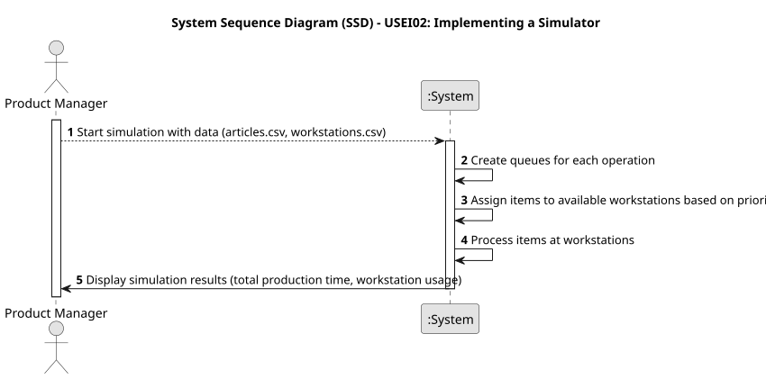

# USEI02 - Implementing a Simulator

## 1. Requirements Engineering

### 1.1. User Story Description

Aa Product Manager I want to implement a simulator that processes all the items.

### 1.2. Customer Specifications and Clarifications 

**From the specifications document:**

> The simulator should load data from two input files: articles.csv and workstations.csv.

> The system should also handle item priority when assigning items to workstations.

> The simulator must create a queue for each operation needed by the articles and assign them to workstations based on availability and processing speed.

**From the client clarifications:**

> **Question:** Can an item have the same operation applied to it more than once? Or can we assume that any operation only shows once in the list?
>
> **Answer:** You can asume, at least for now, that an operation applies to an item just once.

> **Question:** There are repeated lines in the articles.csv, should we consider each one has a production order?
>
> **Answer:** Each line corresponds to one article to be produced.

### 1.3. Acceptance Criteria

* **AC1:** The simulator must create a queue for each operation, containing all items whose next operation is that of the specified queue.
* **AC2:** The simulator must assign items in the queue to the available machine that can perform the required operation the fastest, in the order of their entry into the queue.
* **AC3:** The system should calculate the total production time for the items, taking into account the time spent in the queue and the processing time at the workstation.
* **AC4:** The results should display a list of workstations with the total operation time and the percentage of operation time relative to total execution time, in ascending order.

### 1.4. Found out Dependencies

* **USEI01** - provides the necessary data structures to store the item and workstation information essential for processing simulation.

### 1.5 Input and Output Data

**Input Data:**

* Uploaded File:
  * workstations.csv
  * articles.csv

**Output Data:**

* A list of the total time each workstation spent processing items, 
* A list of the percentage of time each workstation was active relative to the total simulation time
* A list of the total production time for all the items processed and the sequence of operations each item went through and the time spent in queues

### 1.6. System Sequence Diagram (SSD)

### 1.7 Other Relevant Remarks

* None