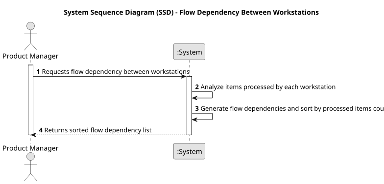

# USEI07 - Flow Dependency Between Workstations

## 1. Requirements Engineering

### 1.1. User Story Description

As a Product Manager I want to produce a list representing the flow dependency between machines. 

 ### 1.2. Customer Specifications and Clarifications 

**From the specifications document:**

>Each workstation processes specific operations for items, and items pass through workstations in a particular sequence.

>The system must analyze the sequence of operations and produce a sorted list of dependencies between workstations, representing the flow of items

>The generated flow should show each workstation’s dependency on others based on the order in which items are processed.

>The output should be ordered by the number of items processed, allowing for easy identification of frequently used paths.

**From the client clarifications:**

> **Question:**
Good afternoon, on US7 the following is mentioned:
The listing should be sorted in descending order of processed items."
My question is in relation to the example given:
"a: m1 -> m5
b: m1 -> m2 -> m4 -> m5
c: m1 -> m2 -> m3 -> m5
d: m1 -> m4 -> m3
e: m1 -> m3 -> m5
After the complete processing of these items, the following listing should be produced:
m1 : [(m2,2),(m5,1),(m3,1),(m4,1)]
m2 : [(m4,1),(m3,1)]
m3 : [(m5,2)]
m4 : [(m5,1),(m3,1)]"
In this example, is the list already sorted in descending order of processed items?
If the answer is yes, then I really don't understand the grading criteria
>
> **Answer:** In this example,
m1 : [(m2,2),(m5,1),(m3,1),(m4,1)]
m2 : [(m4,1),(m3,1)]
m3 : [(m5,2)]
m4 : [(m5,1),(m3,1)]
the number of items processed is:
5
2
2
2
so, I believe it is sorted.

### 1.3. Acceptance Criteria

* **AC1:** Display the map as is requested.
* **AC2:** The system must correctly identify the sequence of workstations each item goes through.
* **AC3:** The system must generate a list of dependencies between workstations, showing the flow of items.
* **AC3:** The list must be ordered by the number of items processed through each dependency path.
 
### 1.4. Found out Dependencies

* **USEI01-** Import and structure data from articles.csv and workstations.csv.
* **USEI04-** Calculate execution times per operation for items.
* **USEI05-** Map and sort execution times and percentages by workstation.

### 1.5 Input and Output Data

**Input Data:**

* Uploaded File:
    * workstations.csv
    * articles.csv 

**Output Data:**

* Presentation of the dependency map

### 1.6. System Sequence Diagram (SSD)

### 1.7 Other Relevant Remarks

* None