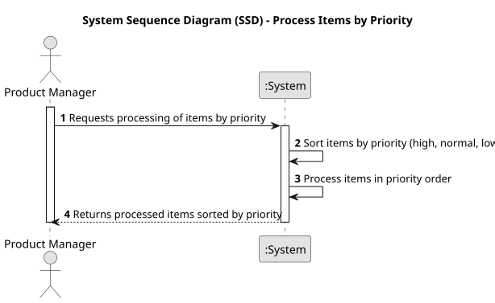

# USEI08 - Process Items by Priority

## 1. Requirements Engineering

### 1.1. User Story Description

As a Product Manager, I want to make an improvement to the simulator developed in USEI02 by taking into account a processing order bases on priority.

### 1.2. Customer Specifications and Clarifications 

**From the specifications document:**

>The system must be capable of persistent data storage, supporting addition and retrieval as needed.

>The customer wants the data organized to optimize access for frequent operations.

**From the client clarifications:**

> No questions for now as this US is quite clear.

### 1.3. Acceptance Criteria

* **AC1:** The items in the queue should be assigned, according to their priority
  (high, normal, low) to the available machine that can perform the required
  operation in the shortest time.
* **AC2:** Statistical measures should be produced similarly for this variant of
  the simulator.

### 1.4. Found out Dependencies

* **USEI02** - as this US is an improvement functionality from it.

### 1.5 Input and Output Data

**Input Data:**

* Uploaded File:
  * workstations.csv
  * articles.csv

**Output Data:**

* Items being operated by priority order.

### 1.6. System Sequence Diagram (SSD)

### 1.7 Other Relevant Remarks

* None