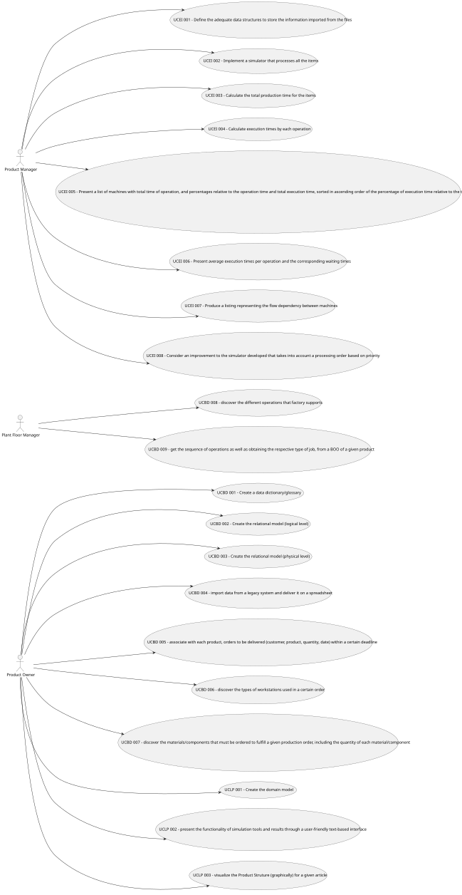

# Use Case Diagram (UCD)

# Use Cases / User Stories

| UC/US   | Description                                                                                                                 |                   
|:--------|:----------------------------------------------------------------------------------------------------------------------------|
| USEI001 | [Define the data](../../us001/Readme.md)                                                                                    |
| USEI002 | [Implement a simulator](../../us002/Readme.md)                                                                              |
| USEI006 | [Calculate the total production](../../us003/Readme.md)                                                                     |
| USEI004 | [Calculate execution times](../../us004/Readme.md)                                                                          |
| USEI005 | [Present a list of machines](../../us005/Readme.md)                                                                         |
| USEI006 | [Present average execution times](../../us006/Readme.md)                                                                    |
| USEI007 | [Produce a list of flow dependency](../../us007/Readme.md)                                                                  |
| USEI008 | [Make a improvement to the simulator](../../us008/Readme.md)                                                                |
| USBD001 | [Create a glossary](../../us007/Readme.md)                                                                                  |
| USBD002 | [Create the relational model(logical level)](../../us008/Readme.md)                                                         |
| USBD003 | [Create the relational model(physical level)](../../us001/Readme.md)                                                        |
| USBD004 | [Import and deliver the data](../../us002/Readme.md)                                                                        |
| USBD005 | [Associate information with their product](../../us003/Readme.md)                                                           |
| USBD006 | [Discover the types of workstations](../../us004/Readme.md)                                                                 |
| USBD007 | [Discover the materials/components that must be ordered](../../us005/Readme.md)                                             |
| USBD008 | [Discover the different operations that factory supports](../../us006/Readme.md)                                            |
| USBD009 | [Get the sequence of operations](../../us007/Readme.md)                                                                     |
| USLP001 | [Create the domain model](../../us008/Readme.md)                                                                            |
| USLP002 | [Present the functionality of simulation tools and results](../../us007/Readme.md)                                                                                                   |
| USLP003 | [Visualize the Product Struture (graphically)](../../us008/Readme.md)                                                       |
