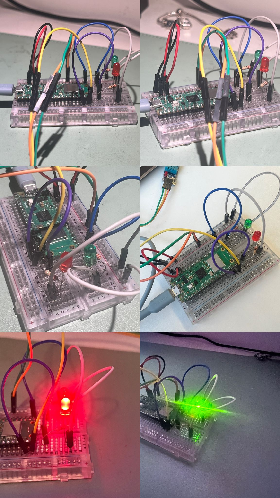

# FSIAP

## Mounted sensor



## USFA01
* Using Arduino, we created a code that would allow us to monitor temperatures and humidity, and the behavior of the respective LEDs.

`````java
    #include <DHT.h> // Include the DHT library for sensor functionality

// Define pins for the DHT sensor and LEDs
        #define DHTPIN 15     // Pin where the DHT sensor is connected
        #define DHTTYPE DHT11 // Type of the DHT sensor (DHT11 or DHT22)
        #define TEMP_LED 14   // Pin for the temperature LED
        #define HUM_LED 16    // Pin for the humidity LED

        DHT dht(DHTPIN, DHTTYPE); // Create a DHT object with the specified pin and type

// Variables to store initial temperature and humidity readings
        float initialTemperature = 0;
        float initialHumidity = 0;

        void setup() {
        Serial.begin(9600); // Start serial communication at 9600 baud
        dht.begin(); // Initialize the DHT sensor

        pinMode(TEMP_LED, OUTPUT); // Set the temperature LED pin as output
        pinMode(HUM_LED, OUTPUT);  // Set the humidity LED pin as output

        // Read initial values from the sensor
        initialTemperature = dht.readTemperature();
        initialHumidity = dht.readHumidity();

        // Check for sensor reading errors
        if (isnan(initialTemperature) || isnan(initialHumidity)) {
        Serial.println("Error reading sensor. Check the connection!");
        while (true); // Halt the program if the sensor has issues
        }

        // Print initial readings to the serial monitor
        Serial.print("Initial Temperature: ");
        Serial.print(initialTemperature);
        Serial.println(" °C");
        Serial.print("Initial Humidity: ");
        Serial.print(initialHumidity);
        Serial.println(" %");
        }

        void loop() {
        // Read current temperature and humidity
        float currentTemperature = dht.readTemperature();
        float currentHumidity = dht.readHumidity();

        // Check for reading errors
        if (isnan(currentTemperature) || isnan(currentHumidity)) {
        Serial.println("Error reading sensor. Skipping this cycle...");
        return; // Skip the rest of the loop if there's an error
        }

        // Print current readings to the serial monitor
        Serial.print("Current Temperature: ");
        Serial.print(currentTemperature);
        Serial.println(" °C");
        Serial.print("Current Humidity: ");
        Serial.print(currentHumidity);
        Serial.println(" %");

        // Control the temperature LED
        if (currentTemperature >= initialTemperature + 5) { // If temperature increases by 5°C
        if (digitalRead(TEMP_LED) == LOW) { // Check if the LED is off
        Serial.println("LED_TEMP_ON"); // Log the event
        }
        digitalWrite(TEMP_LED, HIGH); // Turn the LED on
        } else {
        if (digitalRead(TEMP_LED) == HIGH) { // Check if the LED is on
        Serial.println("LED_TEMP_OFF"); // Log the event
        }
        digitalWrite(TEMP_LED, LOW); // Turn the LED off
        }

        // Control the humidity LED
        if (currentHumidity >= initialHumidity + 5) { // If humidity increases by 5%
        if (digitalRead(HUM_LED) == LOW) { // Check if the LED is off
        Serial.println("LED_HUM_ON"); // Log the event
        }
        digitalWrite(HUM_LED, HIGH); // Turn the LED on
        } else {
        if (digitalRead(HUM_LED) == HIGH) { // Check if the LED is on
        Serial.println("LED_HUM_OFF"); // Log the event
        }
        digitalWrite(HUM_LED, LOW); // Turn the LED off
        }

        delay(2000); // Wait 2 seconds before the next loop iteration
        }

````````

## USFA02
* In order for the file to be created, we used a code that we made in python and associated it with the arduino.

``````java
import serial
import time
from datetime import datetime

PORT = "COM5"  
        BAUD_RATE = 9600
        LOG_FILE = "sensor_logs.txt"

        def main():
        try:
        with serial.Serial(PORT, BAUD_RATE, timeout=5) as ser:
        print(f"Connected to Arduino on {PORT}.")
        print(f"Logging data to {LOG_FILE}...")

        with open(LOG_FILE, "a") as log_file:
        log_file.write("Timestamp,Temperature (°C),Humidity (%),Event\n")

        temp = None
        hum = None

        while True:
        line = ser.readline().decode('utf-8').strip()

        if line:
        print(f"Received: {line}")
        timestamp = datetime.now().strftime("%Y-%m-%d %H:%M:%S")

        if "Temperatura atual:" in line:
        temp = line.split(":")[1].strip(" °C")
        elif "Humidade atual:" in line:
        hum = line.split(":")[1].strip(" %")
        elif "LED_TEMP_ON" in line:
        log_file.write(f"{timestamp},,,LED de temperatura ligado\n")
        print(f"Event logged: LED de temperatura ligado")
        elif "LED_TEMP_OFF" in line:
        log_file.write(f"{timestamp},,,LED de temperatura desligado\n")
        print(f"Event logged: LED de temperatura desligado")
        elif "LED_HUM_ON" in line:
        log_file.write(f"{timestamp},,,LED de humidade ligado\n")
        print(f"Event logged: LED de humidade ligado")
        elif "LED_HUM_OFF" in line:
        log_file.write(f"{timestamp},,,LED de humidade desligado\n")
        print(f"Event logged: LED de humidade desligado")

        if temp is not None and hum is not None:
        log_file.write(f"{timestamp},{temp},{hum},\n")
        print(f"Logged: {timestamp}, Temp: {temp}°C, Hum: {hum}%")
        temp, hum = None, None
        except serial.SerialException as e:
        print(f"Error connecting to serial port: {e}")
        except KeyboardInterrupt:
        print("\nLogging stopped by user.")
        except Exception as e:
        print(f"An unexpected error occurred: {e}")

        if __name__ == "__main__":
        main()

``````
**Output USFA02:**

sensor_logs.txt