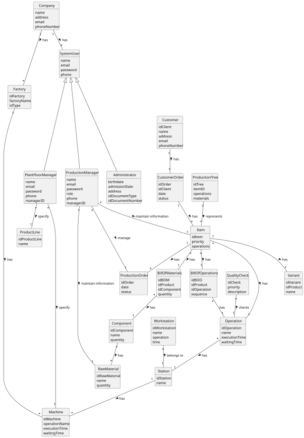

# OO Analysis

The construction process of the domain model is based on the client specifications, especially the nouns (for _concepts_) and verbs (for _relations_) used.

## Rationale to identify domain conceptual classes
To identify domain conceptual classes, start by making a list of candidate conceptual classes inspired by the list of categories suggested in the book "Applying UML and Patterns: An Introduction to Object-Oriented Analysis and Design and Iterative Development".

### _Conceptual Class Category List_

**Business Transactions**

* ProductionOrder
* CustomerOrder

---

**Transaction Line Items**

* BOM/Materials
* BOO/Operations

---

**Product/Service related to a Transaction or Transaction Line Item**

* Item
* Variant

---

**Transaction Records**

* QualityCheck

---

**Roles of People or Organizations**

* ProductionManager
* PlantFloorManager
* Administrator
* Customer
* SystemUser

---

**Places**

* Factory
* Station
* Workstation

---

**Noteworthy Events**

* QualityCheck Event (Derived)

---

**Physical Objects**

* Machine
* Component
* RawMaterial

---

**Descriptions of Things**

* Operation
* ProductionTree

---

**Catalogs**

* ProductLine

---

**Organizations**

* Company

---

## Rationale to identify associations between conceptual classes

An association is a relationship between instances of objects that indicates a relevant connection and that is worth remembering, or it is derivable from the List of Common Associations:

- **_A_** is physically or logically part of **_B_**
- **_A_** is physically or logically contained in/on **_B_**
- **_A_** is a description for **_B_**
- **_A_** known/logged/recorded/reported/captured in **_B_**
- **_A_** uses or manages or owns **_B_**
- **_A_** is related with a transaction (item) of **_B_**

---

| Concept (A)              | Association       | Concept (B)                |
|--------------------------|-------------------|----------------------------|
| Company                  | owns              | Factory                    |
| SystemUser               | has role          | ProductionManager          |
| SystemUser               | has role          | PlantFloorManager          |
| SystemUser               | has role          | Administrator              |
| ProductionManager        | manages           | ProductionOrder            |
| ProductionManager        | manages           | BOM/Materials              |
| PlantFloorManager        | specifies         | Station                    |
| PlantFloorManager        | specifies         | Workstation                |
| Administrator            | manages users     | SystemUser                 |
| Customer                 | places            | CustomerOrder              |
| CustomerOrder            | linked to         | ProductionOrder            |
| ProductionOrder          | specifies         | BOM/Materials              |
| ProductionOrder          | specifies         | BOO/Operations             |
| ProductionTree           | represents        | Item                       |
| Item                     | has component     | RawMaterial                |
| Item                     | has component     | Component                  |
| Workstation              | performs          | Operation                  |
| Station                  | belongs to        | Factory                    |
| Machine                  | performs          | Operation                  |
| QualityCheck             | checks            | Operation                  |

## Domain Model

