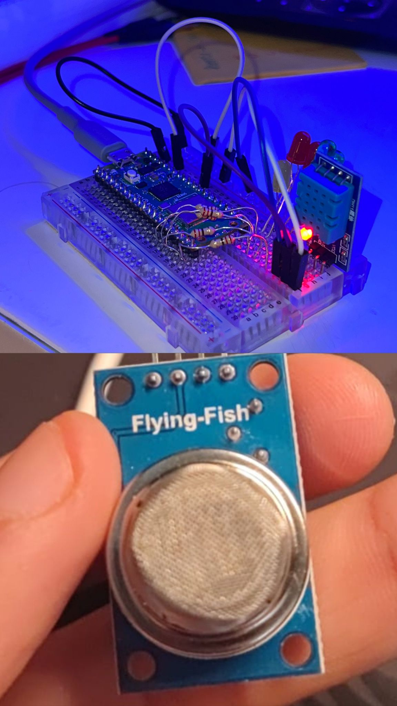

# FSIAP

## Mounted sensor



## USFA03
* Implement the functionality to simulate, analyze, and manage the behavior of industrial systems, focusing on data processing, operation sequences, and resource optimization as outlined in the user stories for Sprint 3.

`````java
#include <MQSpaceData.h>
#include <DHT.h>
#include <math.h>

#define ADC_RESOLUTION_BITS  (10)
#define ANALOG_INPUT_PIN     (A0)
#define LOAD_RESISTANCE      10.0
        #define CLEAN_AIR_RS_RO      60.0
        #define RED_FAN_PIN          11
        #define YELLOW_FAN_PIN       12
        #define DHT_SENSOR_PIN       26
        #define DHT_SENSOR_TYPE      DHT11

DHT dhtSensor(DHT_SENSOR_PIN, DHT_SENSOR_TYPE);

MQSpaceData mqSensor(ADC_RESOLUTION_BITS, ANALOG_INPUT_PIN);

float baselineRsRo = 0.0;
bool areFansOn = false;
float baselineHumidity = 0.0;
bool isHumidityAlerted = false;
float baselineTemperature = 0.0;
bool isTemperatureAlerted = false;

void setup() {
    Serial.begin(115200);

    pinMode(RED_FAN_PIN, OUTPUT);
    pinMode(YELLOW_FAN_PIN, OUTPUT);
    digitalWrite(RED_FAN_PIN, LOW);
    digitalWrite(YELLOW_FAN_PIN, LOW);

    mqSensor.begin();
    dhtSensor.begin();
    Serial.println("Initializing MQ-2 and DHT sensors...");
    delay(5000);

    baselineHumidity = dhtSensor.readHumidity();
    baselineTemperature = dhtSensor.readTemperature();
    Serial.print("Initial Humidity: ");
    Serial.println(baselineHumidity);
    Serial.print("Initial Temperature: ");
    Serial.println(baselineTemperature);
    Serial.println("Sensors ready to measure gases and humidity/temperature!");
}

void loop() {
    float rawSensorValue = analogRead(ANALOG_INPUT_PIN);
    float sensorVoltage = (rawSensorValue / 1023.0) * 5.0;

    float sensorResistance = (5.0 - sensorVoltage) / sensorVoltage * LOAD_RESISTANCE;

    float rsRoRatio = sensorResistance / CLEAN_AIR_RS_RO;

    // Fórmula ajustada para o MQ-2
    float gasConcentration = 1000 * pow(rsRoRatio, -2.3);  // Exemplo para gás combustível

    static float filteredGasConcentration = gasConcentration;
    filteredGasConcentration = 0.9 * filteredGasConcentration + 0.1 * gasConcentration;

    Serial.print("Rs/Ro Ratio: ");
    Serial.print(rsRoRatio, 2);
    Serial.print(" | Gas Concentration (ppm): ");
    Serial.println(filteredGasConcentration, 2);

    // Lógica de umidade e temperatura permanece inalterada
    float currentHumidity = dhtSensor.readHumidity();
    if (isnan(currentHumidity)) {
        Serial.println("Failed to read humidity!");
        return;
    }

    Serial.print("Current Humidity: ");
    Serial.println(currentHumidity);

    if (baselineHumidity == 0.0) {
        baselineHumidity = currentHumidity;
    } else {
        float humidityChangePercent = (currentHumidity - baselineHumidity) / baselineHumidity * 100.0;

        if (humidityChangePercent >= 10.0 && !isHumidityAlerted) {
            digitalWrite(RED_FAN_PIN, HIGH);
            delay(10000);
            digitalWrite(RED_FAN_PIN, LOW);

            digitalWrite(YELLOW_FAN_PIN, HIGH);
            delay(10000);
            digitalWrite(YELLOW_FAN_PIN, LOW);

            isHumidityAlerted = true;
        }
    }

    float currentTemperature = dhtSensor.readTemperature();
    if (isnan(currentTemperature)) {
        Serial.println("Failed to read temperature!");
        return;
    }

    Serial.print("Current Temperature: ");
    Serial.println(currentTemperature);

    if (baselineTemperature == 0.0) {
        baselineTemperature = currentTemperature;
    } else {
        float temperatureChange = currentTemperature - baselineTemperature;

        if (temperatureChange >= 5.0 && !isTemperatureAlerted) {
            digitalWrite(YELLOW_FAN_PIN, HIGH);
            delay(5000);
            digitalWrite(YELLOW_FAN_PIN, LOW);

            digitalWrite(RED_FAN_PIN, HIGH);
            delay(5000);
            digitalWrite(RED_FAN_PIN, LOW);

            isTemperatureAlerted = true;
        }
    }

    if (baselineRsRo == 0.0) {
        baselineRsRo = rsRoRatio;
    } else {
        float rsRoChangePercent = abs(rsRoRatio - baselineRsRo) / baselineRsRo * 100.0;

        if (rsRoChangePercent >= 10.0 && !areFansOn) {
            digitalWrite(RED_FAN_PIN, HIGH);
            digitalWrite(YELLOW_FAN_PIN, HIGH);
            areFansOn = true;

            delay(10000);

            digitalWrite(RED_FAN_PIN, LOW);
            digitalWrite(YELLOW_FAN_PIN, LOW);
        }
    }

    delay(1000);
}
````````

