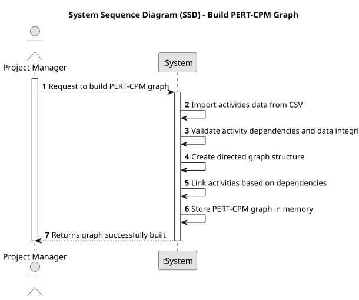

# USEI17 - Build PERT-CPM Graph
## 1. Requirements Engineering

### 1.1. User Story Description
As a Production Manager, I want to register customer orders in the system, ensuring each order is linked to active customers and valid products, so production planning can be carried out effectively.

### 1.2. Customer Specifications and Clarifications 

**From the specifications document:**

>Orders must be registered in the system with details about the customer, product, and quantity. Each order must be linked to an active customer and a product currently available in the production line.

>The system must validate that the customer and product exist before an order can be registered.

**From the client clarifications:**

> No questions for now as this US is quite clear.

### 1.3. Acceptance Criteria

* **AC1:** The system must allow the creation of new orders by specifying the customer, product, and quantity.
* **AC2:** Orders can only be registered if the customer is active and the product exists in the current production line..
* **AC3:** The system must provide feedback when an order registration fails due to invalid customer or product information.

### 1.4. Found out Dependencies

* **USEI01:** Data structures for storing customer and product information imported from respective input files.
* **USEI11:** Validation mechanisms to check the status of customers and the availability of products.

### 1.5 Input and Output Data

**Input Data:**

* Uploaded File:
  * customers.csv
  * products.csv

* Order data

**Output Data:**

* Success message for successfully registered orders.
* Failure message with reasons (e.g., inactive customer, unavailable product) when registration fails.

### 1.6. System Sequence Diagram (SSD)

### 1.7 Other Relevant Remarks

* None