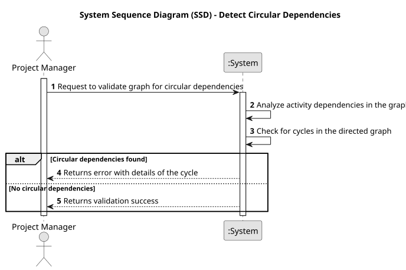

# USEI18 - Detect Circular Dependencies

## 1. Requirements Engineering

### 1.1. User Story Description

As a Production Manager, I want to reserve materials and components needed for specific orders without automatically deducting them from stock, ensuring availability while maintaining accurate inventory records.

### 1.2. Customer Specifications and Clarifications 

**From the specifications document:**

>The system must allow for material and component reservations linked to specific orders. Reservations should only be created if the entire order can be fulfilled based on current inventory levels.

>Reserved quantities must be recorded but not automatically deducted from stock until the order is processed

**From the client clarifications:**

> **Question:** Can an item have the same operation applied to it more than once? Or can we assume that any operation only shows once in the list?
>
> **Answer:** You can asume, at least for now, that an operation applies to an item just once.

> **Question:** There are repeated lines in the articles.csv, should we consider each one has a production order?
>
> **Answer:** Each line corresponds to one article to be produced.

### 1.3. Acceptance Criteria

* **AC1:** The system must reserve materials and components for specific orders only if the entire order can be fulfilled. 
* **AC1:** Reserved quantities must be clearly recorded without reducing the current stock.
* **AC1:** The system must allow users to view a list of all reserved materials and components, including their quantities and associated order IDs.

### 1.4. Found out Dependencies

* **USEI01** Data structures for importing and storing material and inventory data from materials.csv or similar input files.
* **USEI17** Dependencies related to order registration and linking materials/components to specific orders.

### 1.5 Input and Output Data

**Input Data:**

* Uploaded File:
  * materials.csv
  * orders.csv

**Output Data:**

* Success or failure message for reservation attempts, with a reason if the reservation fails.
* A list of reserved materials and components, showing:
<material_id, name, reserved_quantity, associated_order_id>.

### 1.6. System Sequence Diagram (SSD)

### 1.7 Other Relevant Remarks

* None