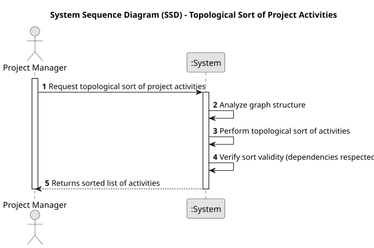

# USEI19 - Topological Sort of Project Activities

## 1. Requirements Engineering

### 1.1. User Story Description

As a Product Manager, I want to query and update inventory levels efficiently, ensuring no stock falls below the reserved amount, to maintain proper inventory control.
### 1.2. Customer Specifications and Clarifications

**From the specifications document:**

>The system must ensure that inventory levels are managed effectively. It should allow for deductions from stock only if the remaining quantity does not fall below the reserved amount.

>Operations attempting to deduct inventory below the reserved level must be rejected with an appropriate notification to the user.performs (from workstations.csv), and a specific execution time for that operation.

**From the client clarifications:**

> **Question:** Should the output be the time that passes since the beggining of production until the end of the last operation of the last item, or the time that each item takes since its first operation to it's last to be processed?
>
> **Answer:** The time diference between the start instant and the end instant of the simulation.

### 1.3. Acceptance Criteria

* **AC1:** The system must prevent stock deduction if the remaining inventory would fall below the reserved amount.
* **AC2:** The system must provide clear feedback when an inventory deduction fails due to insufficient stock.
* **AC3:** The system must allow users to query inventory levels for specific materials or components.

### 1.4. Found out Dependencies

* **USEI01** Data structures for importing and storing inventory information from materials.csv or other input files.
* **USEI10** Functionality for efficiently searching inventory data to support stock queries and updates.
### 1.5 Input and Output Data

**Input Data:**

* Uploaded File:
  * materials.csv

**Output Data:**

* Success or failure message for stock deduction requests.
* Query results showing the current inventory levels of specific materials or components

### 1.6. System Sequence Diagram (SSD)

### 1.7 Other Relevant Remarks

* None