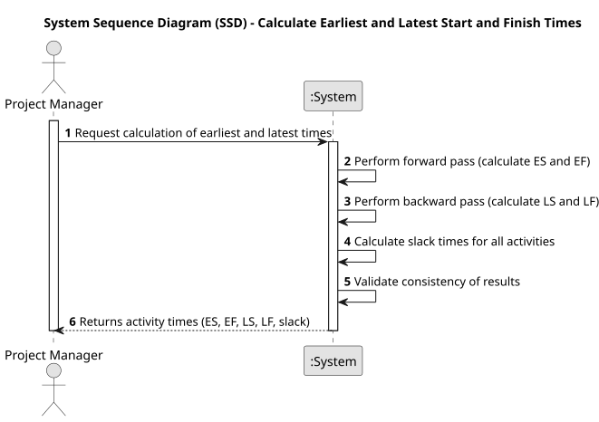

# USEI20 - Calculate Earliest and Latest Start and Finish Times

## 1. Requirements Engineering

### 1.1. User Story Description
As a Product Manager, I want to analyze the dependency flow between workstations, showing the number of items processed in descending order, to identify bottlenecks and improve the production flow.
### 1.2. Customer Specifications and Clarifications

**From the specifications document:**

>The system must calculate and display the dependency flow between workstations based on item transitions during production. Each transition should indicate the number of items processed between the source and target workstations.

>The output should be sorted in descending order by the number of items processed in each flow, enabling users to quickly identify the most active dependencies and potential bottlenecks.

**From the client clarifications:**

> **Question:** The USEI04 states that we should calculate execution times by each operation. Does it mean that we should calculate the total time needed for each operation to be concluded? So if 2 operations of the same type like "cutting" was concluded it should be both of the times added to each other
>
> **Answer:** It means labour time for an operation type.

### 1.3. Acceptance Criteria

* **AC1**: The system must correctly calculate the dependency flow between workstations, showing transitions and the number of items processed in each flow.
* **AC2**: The output must be displayed in descending order based on the number of items processed for each workstation connection

### 1.4. Found out Dependencies

* **USEI01** Data structures for importing and storing workstation and item data from workstations.csv and articles.csv.
* **USEI02** Simulated processing of items to establish the flow dependencies between workstations.

### 1.5 Input and Output Data

**Input Data:**

* Uploaded File:
  * workstations.csv
  * articles.csv

**Output Data:**

* A list of workstation dependency flows in the format:
<workstation_A>: [(workstation_B, count_B), (workstation_C, count_C), ...]
where count_X is the number of items transitioning from workstation_A to workstation_X, ordered by descending item count.

### 1.6. System Sequence Diagram (SSD)

### 1.7 Other Relevant Remarks

* None