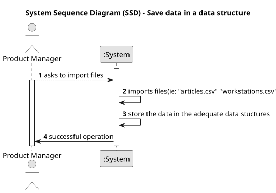

# US001 - Save data in a data structure

## 1. Requirements Engineering

### 1.1. User Story Description
As a Product Manager I want to define the appropriate data structures to store the information imported from the files.

### 1.2. Customer Specifications and Clarifications 

**From the specifications document:**

>The information will be imported from two files: article.csv and workstations.csv.
>>Format of article.csv: <id_item, priority, name_oper1, name_oper2, ..., name_operN>.
>
>>Format of workstations.csv: <id_workstation, name_oper, time>.

>Id_item is a unique identifier for each article.

>Priority defines the production priority (high, normal, low) for each article.

>Workstations have an identifier (id_workstation), a specific operationTest they perform (name_oper), and the execution time (time) for each operationTest.

**From the client clarifications:**

> **Question:** What type of information does a skill have?
>
> **Answer:** A skill only has a name, like: driver, prunner...

### 1.3. Acceptance Criteria

* **AC1:** The system must successfully import data from specified file types (e.g., CSV, JSON, XML) without errors.
* **AC2:** The system must identify and handle duplicate entries according to the specified business rules.
* **AC3:** Each field in the imported files must correctly map to the corresponding data structure attributes, ensuring data types match the specifications.

### 1.4. Found out Dependencies

* None

### 1.5 Input and Output Data

**Input Data:**

* Uploaded File:
    * workstations.csv
    * article.csv

**Output Data:**

* Confirmation of (in)success of the operationTest

### 1.6. System Sequence Diagram (SSD)

### 1.7 Other Relevant Remarks

* None