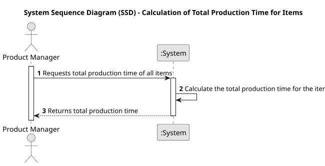

# USEI03 - Calculation of Total Production Time for Items

## 1. Requirements Engineering

### 1.1. User Story Description

As a Product Manager, I want to calculate the total production time that all Items take.

### 1.2. Customer Specifications and Clarifications

**From the specifications document:**

>Each article is subject to a series of sequential operations (e.g., cutting, drilling, polishing) which are carried out by specific workstations.

>The production time of an article is the sum of the execution times for all operations performed on that article.

>Each workstation has an operationTest it performs (from workstations.csv), and a specific execution time for that operationTest.

**From the client clarifications:**

> **Question:** Should the output be the time that passes since the beggining of production until the end of the last operationTest of the last article, or the time that each article takes since its first operationTest to it's last to be processed?
>
> **Answer:** The time diference between the start instant and the end instant of the simulation.

### 1.3. Acceptance Criteria

* **AC1:** The total production time must be related to the whole time it took for all the article.
* **AC2:** The system must correctly handle article that require multiple operations and aggregate the times.

### 1.4. Found out Dependencies

* **USEI01** The data structures are essential for storing article and workstation information
* **USEI02** depends on the simulator to obtain the production flow of article and, therefore, calculate the total production time.

### 1.5 Input and Output Data

**Input Data:**

* Uploaded File:
  * workstations.csv
  * article.csv

**Output Data:**

* Total Production Time.

### 1.6. System Sequence Diagram (SSD)

### 1.7 Other Relevant Remarks

* None