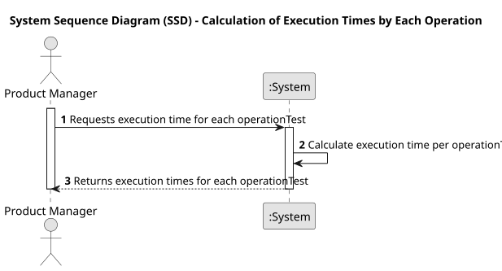

# USEI04 - Calculation of Execution Times by Each Operation

## 1. Requirements Engineering

### 1.1. User Story Description

As a Product Manager, I want to calculate the execution times taken by each operationTest.

### 1.2. Customer Specifications and Clarifications

**From the specifications document:**

>Each article undergoes a series of operations (e.g., cutting, drilling) with specific execution times, performed at designated workstations.

>The system must be capable of identifying and summing up the execution times for each unique operationTest across all article in the system.

>Execution time per operationTest should be provided in a user-friendly format, with each unique operationTest type listed alongside its cumulative time.

**From the client clarifications:**

> **Question:** The USEI04 states that we should calculate execution times by each operationTest. Does it mean that we should calculate the total time needed for each operationTest to be concluded? So if 2 operations of the same type like "cutting" was concluded it should be both of the times added to each other
>
> **Answer:** It means labour time for an operationTest type.

### 1.3. Acceptance Criteria

* **AC1**: The system must correctly calculate the cumulative execution time for each unique operationTest across all article.
* **AC2:** The program must return the total execution time taken by EACH operationTest.

### 1.4. Found out Dependencies

* **USEI01**-Successful import and structure of data from article.csv and workstations.csv .
* **USEI03**-Calculation of total production time for article, as each operationTest’s time is essential for summing total execution times.

### 1.5 Input and Output Data

**Input Data:**

* Uploaded File:
  * workstations.csv
  * article.csv

**Output Data:**

* Total execution time of each operationTest.

### 1.6. System Sequence Diagram (SSD)

### 1.7 Other Relevant Remarks

* None