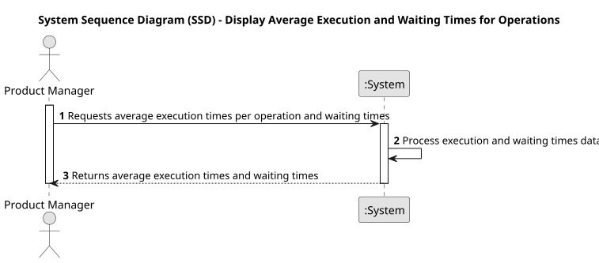

# USEI06- Display Average Execution and Waiting Times for Operations

## 1. Requirements Engineering

### 1.1. User Story Descriptio
As a Product Manager, I want to see the average execution times per operationTest and the corresponding waiting times

### 1.2. Customer Specifications and Clarifications 

**From the specifications document:**

>The production simulation should be capable of generating statistical information, including execution times and waiting times per operationTest.

>The times must be calculated based on the imported data and should consider the production flow of operations across different workstations.

>The simulation must provide a clear view of the average execution times for each operationTest and the corresponding waiting times, allowing an analysis of efficiency and possible bottlenecks.

**From the client clarifications:**

> **Question:** Is it the waiting time of a workstation waiting for an article to start it's operationTest? For example, press station is waiting for a cut operationTest to be done first in another station.
>
> **Answer:** No, average waiting time for article awaiting a specific operationTest to be carried out on them.

> **Question** When we are asked to calculate the waiting times corresponding to the average execution time of an operationTest, what are we referring to? The time it takes for a certain operationTest to be executed, with the waiting time being the sum of the execution times of previous operations, or the time it takes for the same operationTest to happen again?
>
> **Answer:** I'm referring to the time article wait to be processed before a type of operationTest. For example, if in a canteen there is a queue for soup, then another for the main course and another for dessert, I want to know how long a user waits in each queue.

> **Question:** Regarding USEI06, what's the waiting time supposed to be? Is it the waiting time of a workstation waiting for an article to start it's operationTest? For example, press station is waiting for a cut operationTest to be done first in another station.
>
> **Answer:** No, average waiting time for article awaiting a specific operationTest to be carried out on them.

### 1.3. Acceptance Criteria

* **AC1:** The system must correctly calculate the waiting time associated with each operationTest.
* **AC2:** The system must correctly calculate the average execution time for each operationTest based on the input data.
* **AC3:**  The results must be presented to the user in a clear and readable format, allowing the user to view the execution and waiting times per operationTest.
* **AC4:** The calculation must include all ongoing operations, and the results should reflect the current state of the system based on the provided inputs.

### 1.4. Found out Dependencies

**USEI01**-Import and structure data from article.csv and workstations.csv.

**USEI04**-Calculation of execution times per operationTest.

**USEI05**-Mapping of operations and percentages by workstation

### 1.5 Input and Output Data

**Input Data:**

* Uploaded File:
  * workstations.csv
  * article.csv

**Output Data:**

* A list of operations with their average execution times.
* A list of waiting times per operationTest.

### 1.6. System Sequence Diagram (SSD)

### 1.7 Other Relevant Remarks

* None